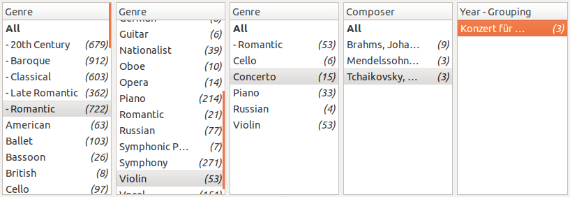
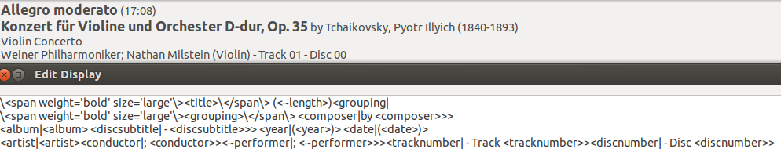

Features
========

- plays music (Vorbis, MP3, & MP4, at least)
- scans user's music folder for tracks
- allows multiple music folders
- stores music's tags
    - allows a track to have several tags with the same key
    - allows a track to have non-standard tags (eg., "CONDUCTOR")
    - library is automatically updated periodically
- music can be filtered by tag (eg: display all COMPOSERs with GENRE=foo)
    - Example: 
    - filters are persistent
    - filters can be skipped
    - tags available to filter against can be a pre-populated list, but allows
      custom tags
    - if a filter has a single child, that child is stepped across
    - several types can be selected at a single filter
    - a series of filter selections is called a playlist
    - selecting a filter & displaying the next level is quick even on large
      libraries
- info displayed about the playing track can be customized according to any
  tags
    - Example: 
    - display for next/previous track can be customized
    - display for tracks in queue & playlists(?) can be customized
    - album artwork can be displayed if available
- have help information for each screen/function
    - display an unobtrusive & context-appropriate "help" button wherever
      possible
- a playlist can be queued easily
    - queue can be cleared
- a playlist can be played on shuffle
    - shuffle is grouped by the next filter level (whatever it happens to be)
    - shuffle can be grouped by an tag not descended from the current filter
- playlists can be saved & named to put them at the top level of filters
    - playlists are sortable
    - playlists can be starred to put them at the top of the list in a
      distinct section
- music player is available from the Google Play store
- Gapless Playback and Replay Gain are used
